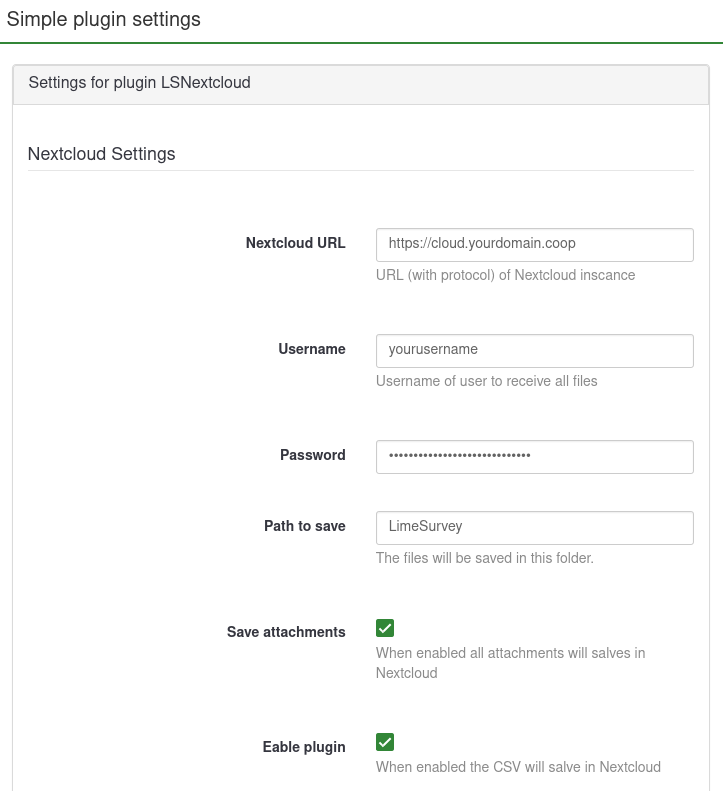

# LimeSurvey LSNextcloud Plugin

Save all survey responses and their attachments automatically to a folder in your Nextcloud.

## Plugin Installation

### By zipfile

- Download the zip of [lates release](https://github.com/LyseonTech/LSNextcloud/releases/latest)
- Install the plugin in `Settings` > `Plugin Manager` > `Install zip`

### By repository

- Clone this repository to de LimeSurvey "plugins" directory
- Run `make all` command

## Configuring

Before all...

- Activate the plugin at the Limesurvey plugin manager (requires proper user rights for accessing the feature at the Limesurvey admin interface).

You can make a global setting or specific settings for each Survey.

### Global setting
- `Settings` > `Plugin Manager
- click on LSNextcloud
- Configure the global settings

### In each Survey setting
- Go to the specific setting for a Survey
- Simple Plugins
- Settings for the LSNextcloud plugin 

The user and password for Nextcloud must be generated in Nextcloud under Settings > Security settings > App password, generate an app password with the name Lime Survey Nextcloud to make it easier to know what this password is from. Copy the password and use it to configure the plugin.
